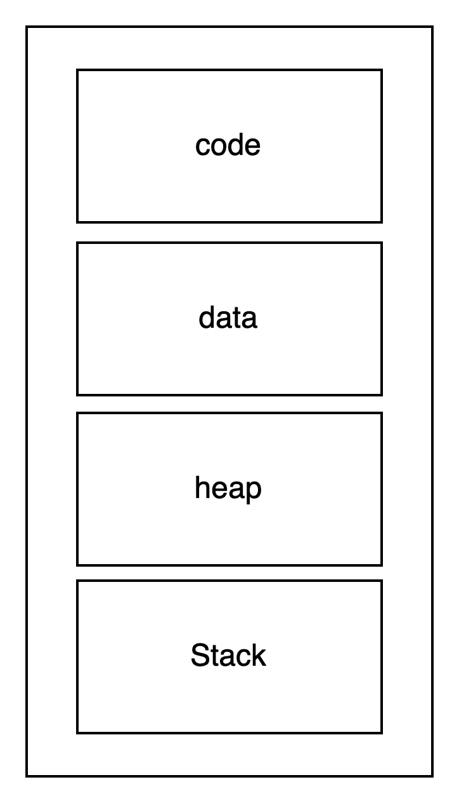
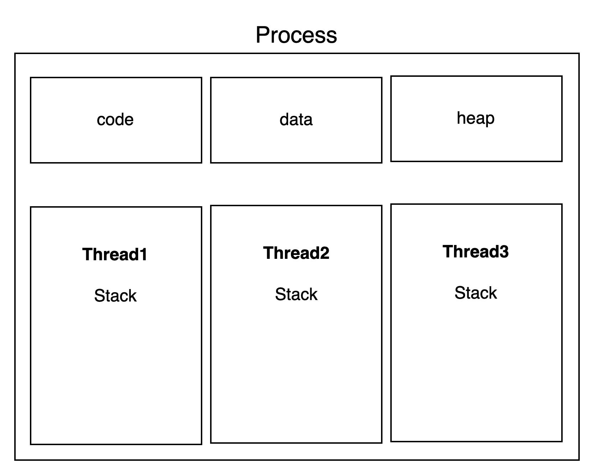
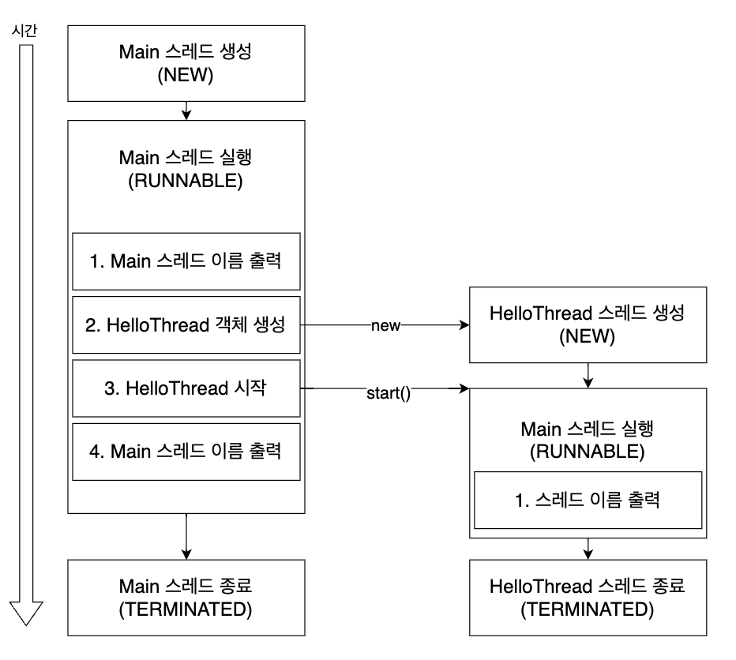
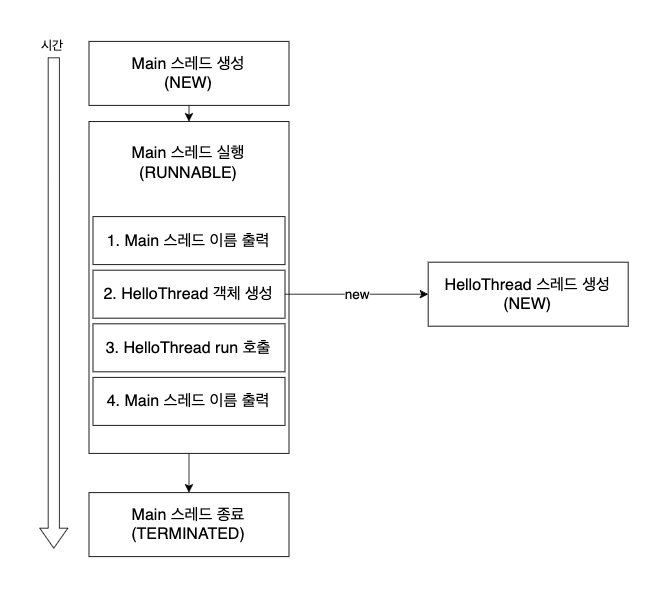
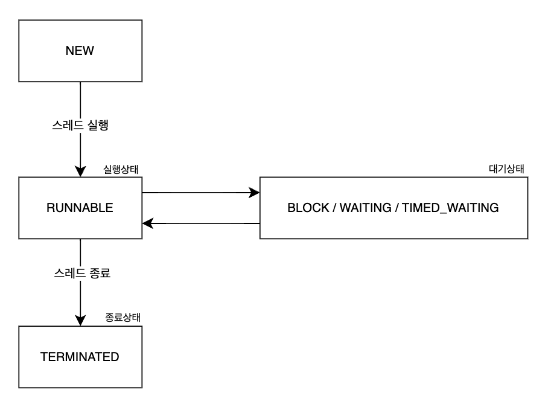

# 프로세스와 스레드

스레드에 대해서 알아보기 전, 프로세스와 스레드가 무엇인지, 그 관계에 대해서 간단하게 살펴보자.

### 프로세스

프로세스는 실행 중에 있는 프로그램을 말한다. 여기서 프로그램은 우리가 작성한 코드 파일이라고 보면 된다. 
파일, 즉, 프로그램을 실행하면 메모리에 파일의 내용이 올라간다. 
이렇게 실행할 수 있는 상태가 되고 실행되면 프로세스가 만들어진다. 
프로세스는 독립적인 메모리 공간을 가진다. 서로 메모리를 공유하지 않는다. 
때문에 서로 다른 프로세스는 각자의 메모리에 있는 자원에 접근할 수 없다.

### 프로세스의 메모리 구성

프로그램을 실행하면 프로세스가 생성된다. 
그 의미는 메모리에 프로세스가 사용할 자원 공간이 할당 되었다는 뜻이다. 프로세스가 실행될 때 메모리 구성은 아래와 같다.



- Code : 코드를 실행하기 위해 저장되어 있는 영역. 즉, 프로그램을 실행시키기 위해 필요한 것을 저장한다.
- data : 전역변수, 정적변수 등이 저장되는 곳이다. 즉, 메인 함수를 시작하기 전부터 프로그램이 끝날 때까지 메모리에 남아있는 데이터를 저장해 둔다.
- heap : 개발자가 동적으로 등록할 수 있는 공간이다. 자바의 경우 new 연산자로 생성하는 경우와 클래스, 참조 변수들도 힙 영역에 위치한다.
- stack : 코드에서 함수를 호출할 때, 지역변수와 매개변수가 저장된다. 함수가 종료되면 관련된 매개변수가 메모리 공간에서 사라진다.

### 스레드

이전에 프로그램을 실행하면 프로그램이 메모리에 올라가게 된다고 말했다. 
그렇게 메모리에 올리는 것을 프로세스라고 한다. 프로세스가 실행된다는 것은 어떤 의미일까? 
개발자가 코드를 작성하면 그에 맞게 실행되는 것을 말하는 것이다. 이처럼 프로세스가 코드를 실행하는 흐름을 스레드라고 한다. 
프로세스를 실행하는 것은 스레드가 코드를 하나하나 실행하는 것을 의미하기 때문에 프로세스는 반드시 스레드를 한개 이상 가지고 있어야 한다.

### 스레드의 메모리 구성



스레드가 하나 생성될 때, stack 영역에 생성된 스레드를 위한 공간이 주어진다. 
위 예시는 하나의 프로세스에 3개의 스레드가 할당 되었을 때 메모리 구성이다.

# 스레드를 구현하는 방법

Thread를 생성하는 방법은 크게 2가지가 있다.

- Thread 클래스 상속하기
- Runnable 인터페이스 구현하기

## Thread 클래스 상속하기

자바에서 제공하는 Thread 클래스를 상속해서 스레드를 만들 수 있다.
```java
public class HelloThread extends Thread {
    @Override
    public void run() {
        System.out.println("["+Thread.currentThread().getName()+"] run");
    }
}
```

위와 같이 run 함수를 오버라이딩 해서 스레드를 실행할 경우 어떻게 동작할지 구현할 수 있다.
## Runnable 인터페이스 구현하기

자바에서 제공하는 Runnable 인터페이스를 구현해서 스레드를 만들 수 있다.

```java
public class HelloRunnable implements Runnable {
    @Override
    public void run() {
        System.out.println("["+Thread.currentThread().getName()+"] run");
    }
}
```

Runnable 인터페이스는 스레드를 실행할 때, 어떻게 동작할지 정의한다. 동작은 run 함수에 정의하면 된다.

# 스레드 실행하기

이렇게 정의만 하면 스레드를 실행시킬 수 없다. 
즉 스레드를 실행할 때 메모리에 자동으로 할당되는 stack 공간이 생기지 않는다. 
스레드를 실행하는 방법은 아래와 같이 start 함수를 사용하면 된다.

### Thread 클래스를 상속한 경우 스레드 실행하기

```java
public class Main {

    public static void main(String[] args) {
        HelloThread helloThread = new HelloThread();
        helloThread.start();
    }

}
```

HelloThread를 생성한 뒤, HelloThread 객체의 start 함수를 실행하면 스레드가 실행된다.

### Runnable 인터페이스를 구현한 경우 스레드 실행하기

```java
public class Main {

    public static void main(String[] args) {
        HelloRunnable runnable = new HelloRunnable();
        HelloTrhead thread = new HelloThread(runnable);
        helloThread.start();
    }

}
```

위 처럼 HelloRunnable을 생성하고 그 값을 HelloThread를 생성할 때 주입해주는 방식으로 스레드를 생성할 수 있다. 
생성한 스레드의 start 함수를 호출하면 스레드가 실행된다.

### 둘 중 어떤 방법이 좋을까?

각 장단점을 표로 비교해보자.

|  | 장점                                                                      | 단점                                                                                |
| --- |-------------------------------------------------------------------------|-----------------------------------------------------------------------------------|
| Thread 상속 | * 구현이 간단하다. 단순히 Thread만 상속하면 된다. * Thread를 상속하면 Thread의 모든 값을 제어할 수 있다. | * 자바는 하나만 단일 상속만 가능해서 Thread를 상속하면 다른 것은 상속할 수 없다. * 인터페이스를 사용하는 것에 비해 유연성이 부족하다. |
| Runnable 구현 | * Runnable을 구현해도 다른 클래스를 상속할 수 있고 다중 구현이 가능하다.* 스레드의 동작만 집중해서 구현할 수 있다. 스레드의 동작만 분리해서 구현하여 가독성을 높인다.* 동작을 여러 스레드가 같이 공유할 수 있다. | * 코드가 복잡해진다. |

위 표를 읽어보면 Thread 상속 보다 Runnable을 구현해서 생성자 주입을 해주는 것이 더 좋은 방법인 것을 알 수 있다. 
Thread 상속을 하면 Thread의 여러 함수를 오버라이딩해서 Thread의 세밀한 부분을 제어할 수 있다는 장점이 있다. 
그러나 상속 제한의 문제와 스레드가 동일한 동작을 하더라도, 스레드 클래스를 각각 만들어야 한다는 큰 단점이 있다. 
때문에 코드가 한줄 더 늘더라도 Runnable을 사용하자.

# 스레드의 실행

## 스레드 실행과정

아래 코드를 실행시켜 보자. 그럼 어떤 일이 발생할까?

```java
public class HelloThread extends Thread {
    @Override
    public void run() {
        System.out.println("["+Thread.currentThread().getName()+"] run");
    }
}

public class Main {

    public static void main(String[] args) {
        System.out.println("스레드 시작 : "+Thread.currentThread().getName());
        HelloThread helloThread = new HelloThread();
        helloThread.start();
        System.out.println("스레드 종료 : "+Thread.currentThread().getName());
    }

}
```

main 함수를 실행하면 실행 흐름은 아래와 같다.

1. Main 스레드가 실행하면서 코드를 차례차례 실행한다.
2. Main 스레드는 “스레드 시작”과 Main 스레드 이름을 출력한다.
3. Main 스레드가 HelloThread 객체를 생성한다.
4. Main 스레드가 HelloThread를 생성하고 실행한다.
    1. Main 스레드는 다시 “스레드 종료”와 Main 스레드 이름을 출력한다.
    2. HelloThread 스레드는 “[스레드 이름] run”을 호출하여 출력한다.

**4-a 와 4-b는 동시에 일어나는 일이다.**

그림을 보면 이해가 더욱 쉬울 것이다.




Main 스레드는 HelloThread를 생성하고 실행한 다음에 HelloThread의 run을 호출하는 것에 관여하지 않는다. 
그저 HelloThread를 실행한 뒤, 본인의 역할(4번)을 하는 것이다. 
HelloThread가 실행되면 HelloThread의 run을 호출하는 것은 HelloThread가 관여한다.

## Thread 클래스의 run()과 start()의 차이

위에서 보다시피, Thread 클래스는 start 함수말고 run이라는 함수도 있다. 
Thread 클래스의 run 함수과 start 함수의 차이는 무엇일까? 둘은 단순히 실행하는 것일까? 
둘은 매우 차이가 크다. 이를 인지하고 코드를 작성하자.

### start 함수를 사용한 경우

start() 함수는 생성한 스레드 객체를 실제로 실행하는 것이다. 
즉, 스레드를 하나 만들어서 실행하는 것이다. 위에서 언급했던 스레드 실행 과정을 따른다.

### run 함수를 사용한 경우

그러나, run 함수는 스레드를 실행시키는 것이 아니다. 단순히 Thread에서 정의한 run함수를 실행할 뿐이다. 
코드를 보자.

```java
public class HelloThread extends Thread {
    @Override
    public void run() {
        System.out.println("["+Thread.currentThread().getName()+"] run");
    }
}

public class Main {

    public static void main(String[] args) {
        System.out.println("스레드 시작 : "+Thread.currentThread().getName());
        HelloThread helloThread = new HelloThread();
        helloThread.run(); // start()가 아닌, run() 호출
        System.out.println("스레드 종료 : "+Thread.currentThread().getName());
    }

}
```

위 코드는 start 함수를 사용했을 때와 같은 동작을 할까? 동작 순서는 아래와 같다.

1. Main 스레드가 실행하면서 코드를 차례차례 실행한다.
2. Main 스레드는 “스레드 시작”과 Main 스레드 이름을 출력한다.
3. Main 스레드는 HelloThread를 생성한다.
4. Main 스레드는 HelloThread의 run을 호출한다.
5. Main 스레드는 다시 “스레드 종료”와 Main 스레드 이름을 출력한다.

그림으로 보면 아래와 같다.



run 함수는 HelloThread에서 어떤 역할을 할지 정의한 것이다. 
때문에 run을 호출하면 단순히 HelloThread 객체의 run함수를 Main 스레드가 호출했을 뿐이다. 
HelloThread는 객체로서 존재하지만 Thread로 실행되지는 않는다. 
즉, 위의 프로세스는 스레드가 1개인 단일 스레드 환경이다.

이처럼 run()함수는 Thread를 실행하는 것이 아닌, 
Thread의 행동을 정의하는 함수이고 이를 호출하면 객체의 함수를 호출하는 것과 같다는 것을 인지해야 한다.

# 스레드 종류

스레드의 종류는 크게 2가지로 나눠진다.

- 사용자 스레드
- 데몬 스레드

## 사용자 스레드

기본적으로 자바 애플리케이션에서 생성하는 스레드를 말한다. 특별히 어떤 설정을 하지 않으면 모두 사용자 스레드다. 
사용자 스레드는 애플리케이션이 종료되기 전까지 계속 실행된다. 
즉, 사용자 스레드가 모두 실행되고 종료 되어야 애플리케이션을 종료한다.

## 데몬 스레드

데몬 스레드는 백그라운드에서 실행되는 스레드를 말한다. 데몬 스레드는 부가적인 작업을 처리하는데 사용된다. 
사용자 스레드와 달리, 애플리케이션이 종료될 때, 데몬스레드의 생존 여부를 고려하지 않는다. 
즉, 데몬 스레드가 아직 종료되지 않았다고 해서 애플리케이션이 종료가 안되는 것은 아니다.

### 데몬 스레드로 설정하는 법

아래와 같이 setDaemon() 함수를 사용하면

```java
public class Main {

    public static void main(String[] args) {
        HelloRunnable runnable = new HelloRunnable();
        HelloThread thread = new Thread(runnable);
        thread.setDaemon(true); // 데몬 스레드 설정
        thread.start();
    }
}
```

## 사용자 스레드와 데몬 스레드의 비교

|  | 사용자 스레드 | 데몬 스레드                                            |
| --- | --- |---------------------------------------------------|
| 설명 | 자바 애플리케이션에서 생성하는 스레드 | 백그라운드에서 실행되는 스레드                                  |
| 특징 | * 사용자 스레드가 모두 종료되어야 애플리케이션이 종료된다.* 메인 작업 수행 | * 데몬 스레드는 애플리케이션의 생명주기에 영향을 미치지 않는다. * 보조적인 작업 수행 |
| 예시 | * 애플리케이션의 주요 작업* 데이터베이스와 상호작용하는 작업 | * GC * 로그 처리 스레드                                  |

# 스레드 상태

스레드는 실행 흐름에서 어떤 작업을 수행 중인지, 
그 작업을 위해 어떤 자원을 기다리는 지에 따라서 상태가 나누어진다. 
주요 기준은 아래와 같다.

- 실행 가능 여부: 스레드가 CPU를 사용할 준비가 되었는지 여부이다. 이 기준에 따라 스레드는 실행 가능한 상태(실제 CPU에서 실행 중이거나 실행을 기다리는 상태)와 실행 불가능한 상태(대기 중 또는 블로킹된 상태)로 구분된다.
- 자원 대기 여부: 스레드가 어떤 자원을 기다리고 있는지 여부이다. 자바에서는 특정 자원을 기다리면 스레드가 대기 상태에 빠진다. I/O 작업을 기다리거나 다른 스레드가 가지고 있는 락을 기다릴 때가 예이다.
- 종료 여부: 스레드가 종료되었는지 여부이다. 스레드가 모든 작업을 마치면 종료 상태로 변경된다. 종료가 되면 더 이상 실행되지 않고 자원이 회수된다.

위의 기준으로 스레드 상태는 크게 6가지로 나누어진다.




- **NEW (생성)**: 스레드가 생성되었지만 아직 실행 준비가 되지 않은 상태이다. 즉, new 연산자를 통해 Thread를 생성했지만 아직 실행(start)하지 않은 상태를 말한다.
- **RUNNABLE (실행 가능)**: CPU에서 실행되거나 실행 대기 중인 상태. 실행 가능한 상태이며, 자원을 기다리지 않는 상태를 말한다.

  > RUNNABLE 상태
  운영 체제 스케줄러의 실행 대기열에 존재하는 경우, CPU에서 실제 실행되고 있는 경우 모두 RUNNABLE 상태이다. 자바에서 이 둘을 구별하지 않는다.

- **BLOCKED (차단)**: 스레드가 동기화 락을 기다리는 상태이다. 자원에 접근할 수 있을 대까지 대기한다.
- **WAITING (대기)**: 스레드가 무기한으로 다른 스레드의 작업을 기다리는 상태이다.
- **TIMED_WAITING (시간 제한 대기)**: 스레드가 일정 시간 동안 다른 스레드의 작업을 기다리는 상태이다.
- **TERMINATED (종료)**: 스레드가 실행을 모두 마치고 종료된 상태이다. 종료되면 자원이 회수된다.

# 출처 및 참고

https://sdhg12.tistory.com/m/18

https://thsd-stjd.tistory.com/149

[https://www.inflearn.com/course/김영한의-실전-자바-고급-1/dashboard](https://www.inflearn.com/course/%EA%B9%80%EC%98%81%ED%95%9C%EC%9D%98-%EC%8B%A4%EC%A0%84-%EC%9E%90%EB%B0%94-%EA%B3%A0%EA%B8%89-1/dashboard)
